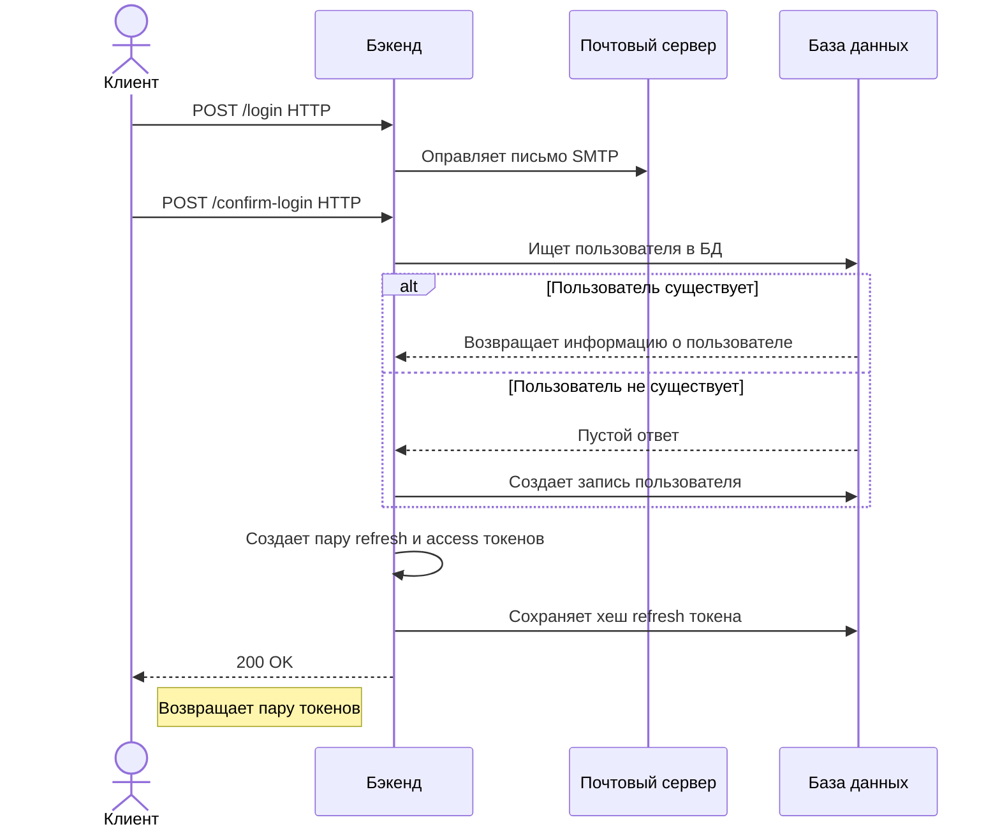

```mermaid
sequenceDiagram
    actor cl as Клиент
    participant s as Бэкенд
    participant ps as Почтовый сервер
    participant db as База данных

    cl->>s: POST /login HTTP
    s->>ps: Оправляет письмо SMTP
    cl->>s: POST /confirm-login HTTP
    s->>db: Ищет пользователя в БД
    alt Пользователь существует
        db-->>s: Возвращает информацию о пользователе
    else Пользователь не существует
        db-->>s: Пустой ответ
        s->>db: Создает запись пользователя
    end
    s->>s: Создает пару refresh и access токенов
    s->>db: Сохраняет хеш refresh токена
    s-->>cl: 200 OK
    Note right of cl: Возвращает пару токенов
```