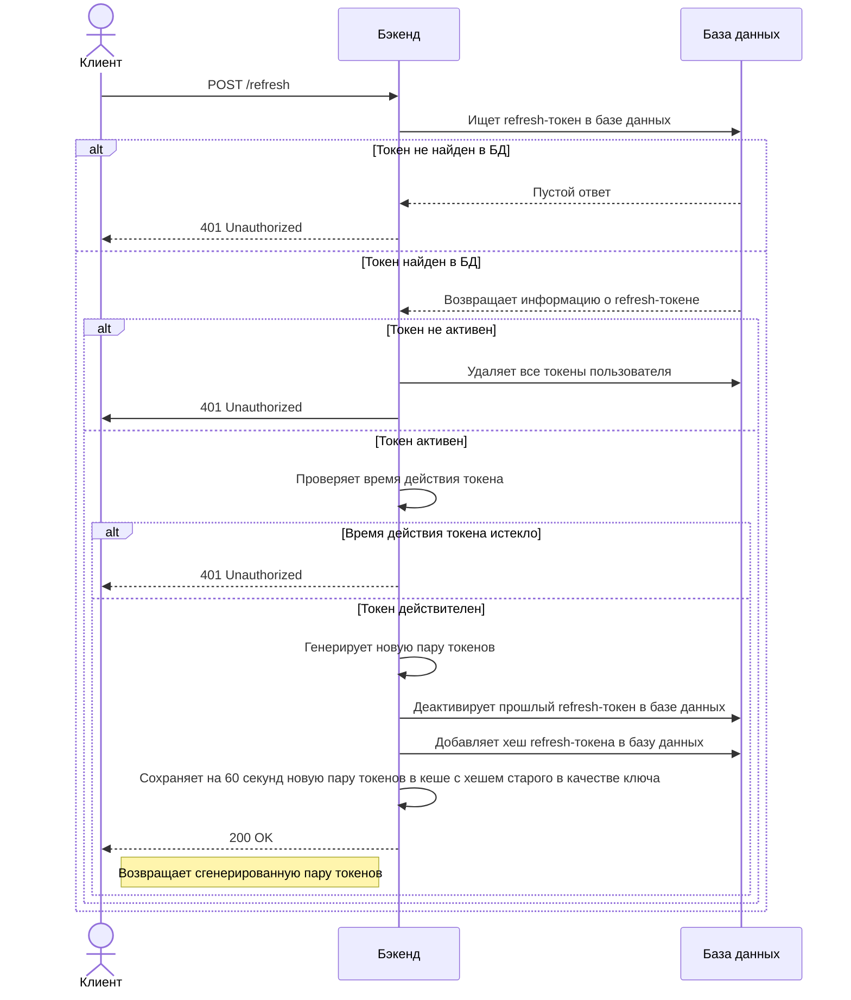

```mermaid
sequenceDiagram
    actor cl as Клиент
    participant s as Бэкенд
    participant db as База данных

    cl->>s: POST /refresh
    s->>db: Ищет refresh-токен в базе данных
    alt Токен не найден в БД
        db-->>s: Пустой ответ
        s-->>cl: 401 Unauthorized
    else Токен найден в БД
        db-->>s: Возвращает информацию о refresh-токене
        alt Токен не активен
            s->>db: Удаляет все токены пользователя
            s->>cl: 401 Unauthorized
        else Токен активен
            s->>s: Проверяет время действия токена
            alt Время действия токена истекло
                s-->>cl: 401 Unauthorized
            else Токен действителен
                s->>s: Генерирует новую пару токенов
                s->>db: Деактивирует прошлый refresh-токен в базе данных
                s->>db: Добавляет хеш  refresh-токена в базу данных
                s->>s: Сохраняет на 60 секунд новую пару токенов в кеше с хешем старого в качестве ключа
                s-->>cl: 200 OK
                Note right of cl: Возвращает сгенерированную пару токенов
            end
        end
    end
```